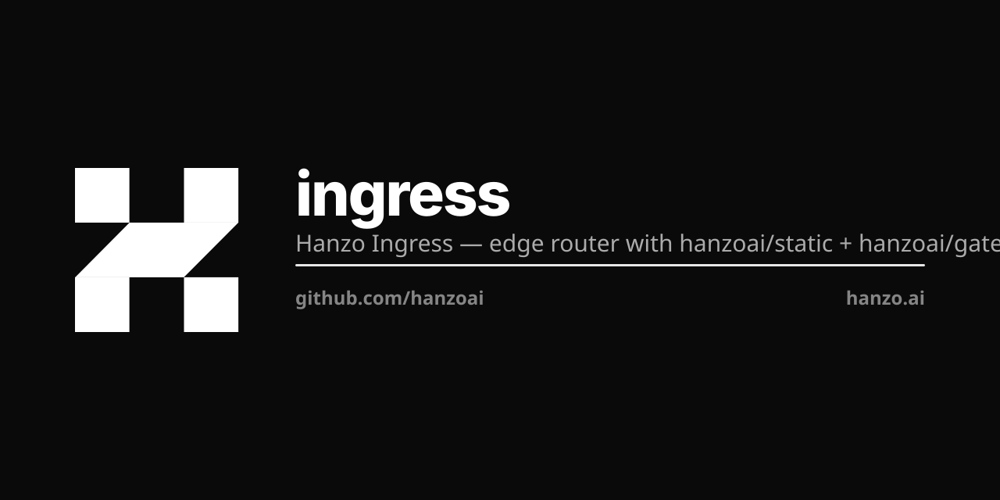

<p align="center"></p>

# Hanzo Ingress

[](https://github.com/hanzoai/ingress/actions/workflows/ci.yml)
[](https://go.dev/)
[](LICENSE.md)
[](https://ghcr.io/hanzoai/ingress)

Cloud-native L7 reverse proxy and load balancer for Hanzo AI infrastructure. Kubernetes-native with automatic TLS, dynamic configuration, and zero-downtime reloads.

## Build dependency: `GOEXPERIMENT=jsonv2`

The HIP-0106 in-process ingress mount runs on the `hanzoai/zip` web
framework, which routes every JSON path through stdlib
`encoding/json/v2` when the binary is compiled with
`GOEXPERIMENT=jsonv2`. The shipped Dockerfile and CI workflow set the
flag; manual builds should do the same:

```bash
GOEXPERIMENT=jsonv2 CGO_ENABLED=0 go build ./cmd/ingress
```

Without the experiment the binary still compiles and runs — zip falls
back to `encoding/json` v1. v2 is preferred for production: ~10%
faster on the edge, ~25% fewer allocations per request. The startup
log line `json_variant=encoding/json/v2` confirms it's active.

No third-party JSON library is allowed in the Hanzo Go stack — stdlib
only (HIP-0106 canonical Hanzo Go stack).

## Overview

Hanzo Ingress is the front door for all Hanzo production traffic. It watches Kubernetes Ingress resources, automatically provisions TLS certificates via Let's Encrypt, and routes traffic to internal services -- including [Hanzo Gateway](https://github.com/hanzoai/gateway) for API endpoints and direct service routing for web applications.

Deployed on the `hanzo-k8s` cluster as the default IngressClass (`ingress`), it handles all `*.hanzo.ai` traffic with 2 replicas in host-network mode for direct port 80/443 binding.

## Features

- **Kubernetes-native** -- watches Ingress resources, auto-configures routes
- **Automatic TLS** -- Let's Encrypt certificate provisioning and renewal (wildcard support)
- **Dynamic configuration** -- zero-restart config updates as Ingress resources change
- **HTTP/2, gRPC, WebSocket** -- full protocol support for all backend types
- **Circuit breakers** -- automatic failure isolation with configurable thresholds
- **Retry logic** -- built-in retry with exponential backoff
- **Access logging** -- JSON and Common Log Format output
- **Metrics export** -- Prometheus, Datadog, StatsD, InfluxDB, OTLP
- **Web dashboard** -- built-in UI for route visualization and health monitoring
- **Single static binary** -- no runtime dependencies, minimal attack surface
- **Host-network mode** -- direct port binding for minimal latency

## Container Images

| Tag | Description |
|-----|-------------|
| `ghcr.io/hanzoai/ingress:latest` | Stable release, production-ready |
| `ghcr.io/hanzoai/ingress:experimental-master` | Latest master build, unstable |
| `ghcr.io/hanzoai/ingress:vX.Y.Z` | Pinned release version |

## Quick Start

### Kubernetes

The workload is declared in `hanzoai/universe`
(`infra/k8s/ingress/`) and reconciled by the operator, so it is not applied
from here. What this repository carries is the cluster-level objects the
workload uses:

```bash
# RBAC, IngressClass, middlewares
kubectl apply -f k8s/hanzo/

# Verify
kubectl -n hanzo get pods -l app.kubernetes.io/name=ingress
```

The manifests are not fetchable by URL: this repository is private, so
`raw.githubusercontent.com` returns 404 without credentials. Clone first.

### Binary

Download a pre-built binary from [GitHub Releases](https://github.com/hanzoai/ingress/releases):

Asset names carry the version, so pin the tag you want:

```bash
# Linux amd64, v1.7.36
curl -sL https://github.com/hanzoai/ingress/releases/download/v1.7.36/hanzo-ingress_v1.7.36_linux_amd64.tar.gz | tar xz

# Run
./hanzo-ingress \
  --entrypoints.web.address=:80 \
  --entrypoints.websecure.address=:443 \
  --providers.kubernetesingress=true
```

### Build from Source

```bash
make build
./hanzo-ingress --configFile=config.toml
```

## Architecture

```
              Internet
                 |
        +--------+--------+
        | Cloudflare CDN  |
        | DNS, WAF, DDoS  |
        +--------+--------+
                 |
        +--------+--------+
        | Hanzo Ingress   |   L7 reverse proxy
        | (ports 80/443)  |   TLS termination
        | IngressClass:   |   Route matching
        |   "ingress"     |   Load balancing
        +--+-+-+-+-+--+---+
           | | | | |  |
     +-----+ | | | |  +--------+
     |   +---+ | | +-----+     |
     |   |  +--+ +--+    |     |
     v   v  v       v    v     v
  +-----+-----+  +----+ +---+ +-------+  +-----+
  | Hanzo     |  | IAM| |KMS| | Cloud |  | PaaS|
  | Gateway   |  +----+ +---+ +-------+  +-----+
  | (API)     |
  +--+--+--+--+
     |  |  |
     v  v  v
  +------+------+------+
  |Engine|Search|  LLM |    Backend services
  +------+------+------+
```

### Request Flow

1. DNS resolves `*.hanzo.ai` to Cloudflare
2. Cloudflare proxies to hanzo-k8s cluster LB (`24.199.76.156`)
3. Hanzo Ingress terminates TLS, matches host/path rules
4. Request forwarded to the matching backend service
5. For API traffic (`api.hanzo.ai`), Ingress routes to Hanzo Gateway for endpoint-level routing

## Middleware Reference

Hanzo Ingress ships with a full suite of built-in middlewares that can be composed via annotations or configuration.

| Middleware | Description |
|------------|-------------|
| **auth** | Forward authentication, basic auth, digest auth |
| **ratelimiter** | Token-bucket rate limiting per client or route |
| **circuitbreaker** | Automatic failure isolation with configurable thresholds |
| **retry** | Automatic retry with exponential backoff |
| **compress** | Gzip/Brotli response compression |
| **headers** | Add, remove, or override request/response headers |
| **ipallowlist** | Restrict access by client IP CIDR ranges |
| **buffering** | Request/response buffering with size limits |
| **inflightreq** | Limit concurrent in-flight requests per source |
| **redirect** | HTTP-to-HTTPS and regex-based URL redirects |
| **stripprefix** | Remove path prefix before forwarding to backend |
| **stripprefixregex** | Remove path prefix by regex pattern |
| **addprefix** | Prepend a path prefix to the forwarded request |
| **replacepath** | Replace the entire request path |
| **replacepathregex** | Replace request path by regex pattern |
| **chain** | Compose multiple middlewares into a named pipeline |
| **passtlsclientcert** | Forward client TLS certificate info as headers |
| **grpcweb** | Translate gRPC-Web requests to native gRPC |
| **contenttype** | Auto-detect and set `Content-Type` headers |
| **customerrors** | Serve custom error pages by status code |
| **recovery** | Recover from panics and return 500 instead of crashing |
| **forwardedheaders** | Trust and propagate `X-Forwarded-*` headers |
| **observability** | Distributed tracing spans (OpenTelemetry, Jaeger, Zipkin) |
| **metrics** | Prometheus, Datadog, StatsD, InfluxDB, OTLP metrics |
| **accesslog** | Structured access logging (JSON, CLF) |
| **capture** | Capture request/response sizes for metrics |
| **snicheck** | Validate TLS SNI against allowed hostnames |
| **tcp** | TCP-level middlewares (IP allowlist, in-flight limit) |

Middlewares are applied via Kubernetes Ingress annotations:

```yaml
metadata:
  annotations:
    hanzo.ai/ingress-ratelimit-average: "100"
    hanzo.ai/ingress-ratelimit-burst: "200"
```

Or via TOML/YAML configuration for non-Kubernetes providers.

## Kubernetes Deployment

### IngressClass

Hanzo Ingress registers as the default IngressClass on the cluster:

```yaml
apiVersion: networking.k8s.io/v1
kind: IngressClass
metadata:
  name: ingress
  annotations:
    ingressclass.kubernetes.io/is-default-class: "true"
spec:
  controller: ingress.k8s.io/ingress-controller
```

Any Ingress resource without an explicit `ingressClassName` is automatically picked up.

### K8s Manifests

```
k8s/hanzo/
  rbac.yaml             # ServiceAccount, ClusterRole, ClusterRoleBinding
  ingressclass.yaml     # IngressClass "ingress" (default)
  middlewares.yaml      # security-headers Middleware CRD
```

The Deployment and its Service are declared in `hanzoai/universe`
(`infra/k8s/ingress/`), which is the one place that says what runs. A copy
here would be a second answer to that question, and the copy that was here
described a different workload than the one the cluster runs.

### Creating Ingress Resources

Once deployed, create standard Kubernetes Ingress resources to route traffic:

```yaml
apiVersion: networking.k8s.io/v1
kind: Ingress
metadata:
  name: my-service
  namespace: hanzo
  annotations:
    cert-manager.io/cluster-issuer: letsencrypt
spec:
  ingressClassName: ingress
  tls:
  - hosts:
    - my-service.hanzo.ai
    secretName: my-service-tls
  rules:
  - host: my-service.hanzo.ai
    http:
      paths:
      - path: /
        pathType: Prefix
        backend:
          service:
            name: my-service
            port:
              number: 8080
```

## Production Deployment

Hanzo Ingress runs on the `hanzo-k8s` DOKS cluster (`24.199.76.156`) as the sole ingress controller for all Hanzo services.

| Property | Value |
|----------|-------|
| **Image** | `ghcr.io/hanzoai/ingress:latest` |
| **Replicas** | 2 |
| **Namespace** | `hanzo` |
| **Network** | hostNetwork (direct port binding) |
| **Ports** | 80 (HTTP), 443 (HTTPS) |
| **Service type** | LoadBalancer |
| **Health check** | `GET /ping` on port 80 |
| **Liveness probe** | HTTP `/ping`, 5s initial, 10s interval |
| **Readiness probe** | HTTP `/ping`, 3s initial, 5s interval |
| **Resources** | 100m-1000m CPU, 128Mi-512Mi memory |
| **Security** | `NET_BIND_SERVICE` capability, all others dropped |

### Deploy / Update

The image tag is pinned in `hanzoai/universe` and rolled by the operator. The
manifests here are the cluster-level objects only:

```bash
kubectl --context do-sfo3-hanzo-k8s apply -f k8s/hanzo/

# Verify pods
kubectl --context do-sfo3-hanzo-k8s -n hanzo get pods -l app.kubernetes.io/name=ingress

# Check service
kubectl --context do-sfo3-hanzo-k8s -n hanzo get svc hanzo-ingress

# View logs
kubectl --context do-sfo3-hanzo-k8s -n hanzo logs -l app=hanzo-ingress --tail=100 -f
```

### Routed Domains (hanzo-k8s)

All domains below resolve through Cloudflare to this ingress instance:

| Domain | Backend Service |
|--------|-----------------|
| `hanzo.ai` | hanzo-app |
| `api.hanzo.ai`, `llm.hanzo.ai` | Hanzo Gateway |
| `hanzo.id` | IAM |
| `kms.hanzo.ai` | KMS |
| `platform.hanzo.ai` | Platform (Dokploy) |
| `console.hanzo.ai` | Console |
| `cloud.hanzo.ai` | Cloud |

## Service Discovery

Hanzo Ingress supports multiple provider backends:

| Provider | Description |
|----------|-------------|
| **Kubernetes Ingress** | Watches `networking.k8s.io/v1` Ingress resources (primary) |
| **Kubernetes CRD** | Watches IngressRoute and related custom resources |
| **Kubernetes Gateway API** | Watches Gateway API resources |
| **File** | Static TOML/YAML configuration files |

Production runs with the Kubernetes Ingress, Kubernetes CRD and File providers.

## Configuration

### CLI Flags (Production)

```bash
./hanzo-ingress \
  --providers.kubernetesingress=true \
  --providers.kubernetesingress.ingressendpoint.publishedservice=hanzo/hanzo-ingress \
  --providers.kubernetesingress.allowemptyservices=true \
  --entrypoints.web.address=:80 \
  --entrypoints.websecure.address=:443 \
  --entrypoints.websecure.http.tls=true \
  --ping=true \
  --ping.entryPoint=web \
  --api.dashboard=false \
  --log.level=INFO \
  --accesslog=true
```

### Configuration File

```toml
[entryPoints]
  [entryPoints.web]
    address = ":80"
  [entryPoints.websecure]
    address = ":443"
    [entryPoints.websecure.http.tls]

[providers]
  [providers.kubernetesIngress]
    [providers.kubernetesIngress.ingressEndpoint]
      publishedService = "hanzo/hanzo-ingress"

[ping]
  entryPoint = "web"

[log]
  level = "INFO"

[accessLog]
```

See the sample configuration files in the repository root for full examples.

## Repository Structure

```
cmd/                    # Binary entry point
internal/               # Core routing, middleware, provider logic
pkg/                    # Public packages and configuration types
webui/                  # Built-in dashboard (React)
k8s/
  hanzo/                # Production K8s manifests
    rbac.yaml           # ServiceAccount + ClusterRole
    ingressclass.yaml   # IngressClass "ingress" (default)
    deployment.yaml     # 2-replica Deployment
    service.yaml        # LoadBalancer Service
integration/            # Integration test suite
contrib/                # Community contributed configs
docs/                   # Extended documentation
Dockerfile              # Multi-stage build (Node webui + Go binary)
Makefile                # Build, test, Docker targets
```

## PaaS Integration

Hanzo Ingress serves as the ingress layer for [Hanzo Platform](https://github.com/hanzoai/platform) (PaaS). Applications deployed through the platform automatically get:

- Ingress resource creation with proper host rules
- TLS certificate provisioning
- Load balancing across application replicas
- Access logging and metrics

## Documentation

Full documentation is available at [docs.hanzo.ai/docs/services/ingress](https://docs.hanzo.ai/docs/services/ingress).

## Related Projects

Hanzo Ingress is part of the Hanzo AI infrastructure stack:

| Project | Role | Repository |
|---------|------|------------|
| [**Hanzo Ingress**](https://github.com/hanzoai/ingress) | L7 reverse proxy, TLS termination, load balancing | `hanzoai/ingress` |
| [**Hanzo Gateway**](https://github.com/hanzoai/gateway) | Trust boundary for the API — identity, rate limiting, circuit breaking | `hanzoai/gateway` |
| [**Hanzo Engine**](https://github.com/hanzoai/engine) | GPU inference engine, model serving | `hanzoai/engine` |
| [**Hanzo Edge**](https://github.com/hanzoai/edge) | On-device inference runtime (mobile, web, embedded) | `hanzoai/edge` |

```
Internet -> Ingress (TLS/L7) -> Gateway (identity) -> Cloud API -> Engine (inference) / Services
                                                          Edge (on-device, client-side)
```

## License

MIT -- see [LICENSE.md](LICENSE.md) and [NOTICE](NOTICE).

Hanzo Ingress is a fork of [Traefik](https://github.com/traefik/traefik)
(Containous SAS, Traefik Labs), which is where the provider model, the
middleware set and the entrypoint/router/service vocabulary come from. The
upstream copyright is preserved in `LICENSE.md`. Anything above that describes
Hanzo-specific deployment, naming or the HIP-0106 in-process mount is ours; the
proxy core is theirs.
